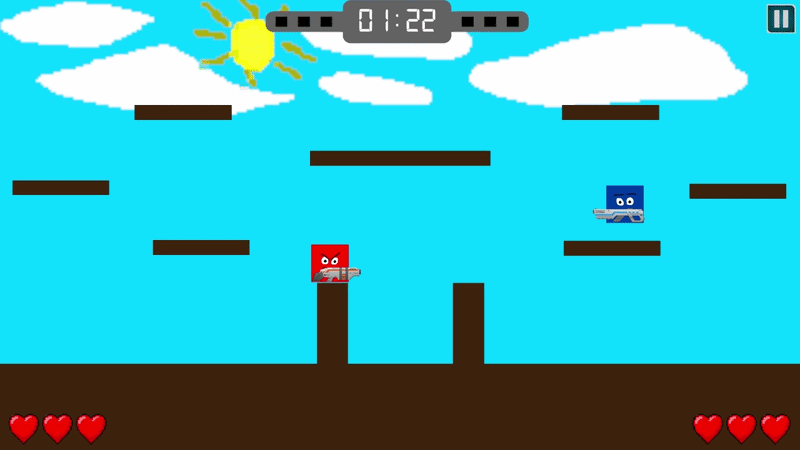

# This is the source code of the game we created, namely "BoxSiege"

### here is the C# code for the game, there are sprites, music, sound effects, and other assets used in the game. we made this game with Unity version 2022.2.21f1. We actually made this game from an assignment given to us by our teacher, and this game took a month to make. There are definitely still bugs in this game, it's not perfect but we are trying our best to make this game work.

## Game Preview:
  

## Tech Stack:
  

    
    
  

## Download Game:
